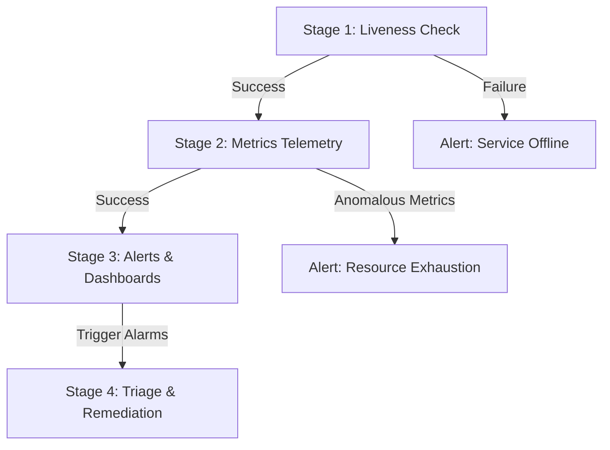

# Redis Per-App Monitoring & Health-Checking Hub

In a per-app Redis architecture, each application has its own dedicated Redis process listening on a separate port with its own isolated memory limits (`maxmemory`). 

To make this architecture easy to operate, we structure health-checking and monitoring into **four logical stages**.

---

## 🗺️ The 4-Stage Monitoring Hierarchy

Before checking advanced metrics or setting up alerting, you must follow a logical troubleshooting path. For instance, if a Redis instance is completely frozen, high-level memory queries might hang. Always check liveness first!



---

## 📂 Detailed Sub-Guides

Explore the dedicated monitoring sub-guides for specific commands, configuration files, and troubleshooting playbooks:

1. 🟢 **[Stage 1: Liveness Testing](file:///c:/Repos/VOS/terraform-apps/terraform-modules/in_memory_data_store/redis/ec2_redis/documentations/monitoring/01_liveness_check.md)**
   * Checking if the TCP port is listening.
   * Sending safe PING commands with authenticated credentials.
   * Querying systemd service status.
2. 📊 **[Stage 2: Metrics & Telemetry](file:///c:/Repos/VOS/terraform-apps/terraform-modules/in_memory_data_store/redis/ec2_redis/documentations/monitoring/02_metrics_monitoring.md)**
   * Measuring memory usage and fragmentation ratio.
   * Checking cache hit rate and key eviction counts.
   * Tracking client connections and debugging slow commands.
3. 🔔 **[Stage 3: Alerting & Dashboards](file:///c:/Repos/VOS/terraform-apps/terraform-modules/in_memory_data_store/redis/ec2_redis/documentations/monitoring/03_alerts_dashboards.md)**
   * Setting up a live terminal monitoring console.
   * Shipping custom metrics to AWS CloudWatch.
   * Configuring Slack webhook notification scripts.
4. 🛠️ **[Stage 4: Memory Remediation & Triage](file:///c:/Repos/VOS/terraform-apps/terraform-modules/in_memory_data_store/redis/ec2_redis/documentations/monitoring/04_remediation.md)**
   * Finding memory leaks (keys without TTL).
   * Configuring Laravel cache code optimizations.
   * Changing `maxmemory` settings at runtime with zero downtime.
   * Manual flushing and resizing the EC2 instance.

---

## ⚡ The Unified Health Check Utility

To simplify checks, use the provided Bash script located in the same directory: 

```bash
# Location of the health-checking script
/in_memory_data_store/redis/ec2_redis/documentations/monitoring/redis-health-check.sh
```

### Quick Usage Examples:
```bash
# 1. Simple liveness ping on default port 6379:
./redis-health-check.sh

# 2. Authenticated check with a password file and service check:
./redis-health-check.sh -p 6380 -f /etc/redis/passwords/port-6380 -s redis-app2

# 3. Check liveness AND print key stats (memory %, clients, hit rate):
./redis-health-check.sh -p 6380 -f /etc/redis/passwords/port-6380 -m
```

---

## 📋 Recommended Eviction Policies Reference

When configuring `redis.conf` for each application, match the `maxmemory-policy` to the workload:

| Workload | Recommended Policy | Expected Behavior when Full |
| :--- | :--- | :--- |
| **Cache Only** | `allkeys-lru` | Silently evicts the least recently used keys. Writes continue without error. |
| **Sessions Only** | `volatile-lru` | Evicts least recently used keys that have a TTL. Permanent locks/keys are preserved. |
| **Queues / Job Workers** | `noeviction` | Never evicts keys. Returns OOM errors to the app so no jobs are silently lost. |
| **Mixed (Cache + Sessions)** | `volatile-lru` | Safe default: only evicts temporary keys (TTLs), preserving permanent database records. |
